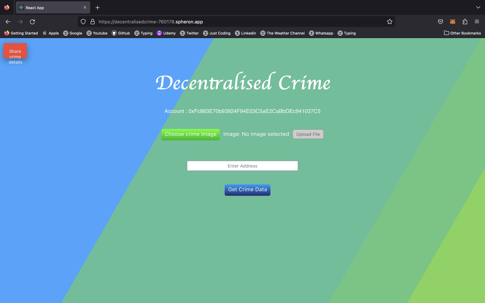
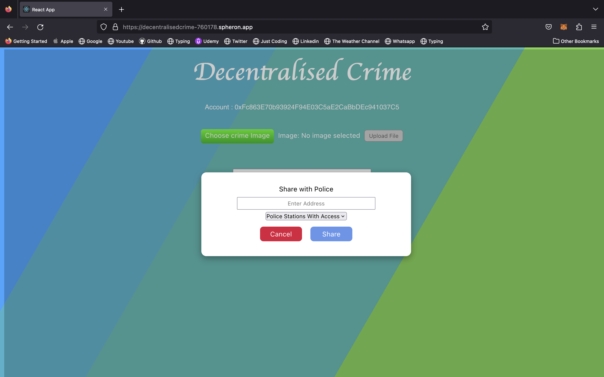

# _DECENTRALISED CRIME_ 

deployed at this link :- https://decentralisedcrime-760178.spheron.app/

🛠 &nbsp;Tech Stack

React, Solidity, Spheron,

## 💼 &nbsp; _Challenges we ran into_

Error in installing of ether module on spheron 

## 🔭 &nbsp; About this Project

> In today's society, many crimes go unreported as people often overlook or fail to report them to the police, leading to a lack of comprehensive crime data and delayed or inadequate law enforcement response.

> This issue results in reduced community safety and hinders effective crime prevention efforts. Also, the lack of a reliable and transparent system for reporting and verifying nearby crimes poses a significant challenge to maintaining public safety. Existing centralized crime reporting methods often suffer from inefficiencies, limited trust, and potential manipulation.

> Therefore, there is a pressing need for a decentralized crime marking and detection app that harnesses the power of blockchain technology to empower individuals to report crimes and enable the community to collectively validate the information's authenticity.

> 

---

**Description of the Project**

`The decentralized crime marking and detection app can leverage blockchain technology to enable individuals to register crime reports on an immutable and transparent ledger. The app should incorporate a voting mechanism, allowing the community to collectively validate the reported crimes. A majority vote of 51% or more would determine the legitimacy of the information, ensuring a fair and democratic decision-making process.`

           
Website

           

         

> Users of the app can register crime incidents they witness or experience in their vicinity. They can provide details such as the type of _crime, location, time, and any other relevant information_. This information is then recorded on the blockchain, ensuring its immutability and transparency.

> > > **Community Validation**: Once a crime report is registered, it is made available to the app's community members for validation. Each member has the opportunity to vote on the authenticity and legitimacy of the reported crime. They can review the provided information and assess its credibility.
> > >   > > > **Voting Mechanism**: The app implements a voting system where community members can cast their vote on whether they believe the reported crime is true or false. Each member's vote holds equal weight.
> > >   > > > **Decision Making**: The voting period has a predefined duration to allow enough time for community participation. At the end of the voting period, the app counts the votes received for each crime report. If a reported crime receives a _majority vote of 51% or more_, it is considered validated by the community.
> > >   > > > **Marking the Crime**: Based on the outcome of the voting process, the app marks the reported crime accordingly. If a crime is validated by the majority, it is labeled as legitimate and remains visible on the app's platform. However, if a crime fails to achieve the majority vote, it is marked as unverified or false, indicating that it may not be accurate.
> > >   > > > **Public Awareness**: The app serves as a public resource, providing real-time information about nearby crimes that have been verified by the community. Users can access the app to

<!-- CONTRIBUTING -->

## Contributing

Contributions are what make the open source community such an amazing place to be learn, inspire, and create. Any contributions you make are _greatly appreciated_.

1. Fork the Project
2. Create your Feature Branch (`git checkout -b feature/AmazingFeature`)
3. Commit your Changes (`git commit -m 'Add some AmazingFeature'`)
4. Push to the Branch (`git push origin feature/AmazingFeature`)
5. Open a Pull Request

---

<!-- LICENSE -->

## 

Distributed under the MIT License. See `LICENSE` for more information.
